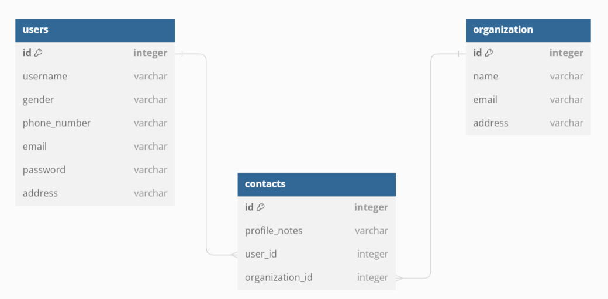

# Contact-Hub

## About

The Contact Hub is a centralized platform designed to facilitate efficient contact organisation. it can also foster connections between users and organizations, fostering collaboration and networking opportunities. Contact Hub can be used in different situations one of them being contact management in organisations with different branches or sublets in different places.

### Key Features

- Sign-up & Login: 
Users can sign-up and login to the Hub.

- User Edit Their Profile:
Once signed up users can edit their profile depending

- Search For Contacts:
Users can search for existing contact in the Hub .

- View Other Contacts & Organizations:
Users can view other users who have signup and organizations

- User-Organization Connectivity:
Seamlessly connect users with organizations

- Contacts Organisation and Management:
Offers a seamless way for big organizations to manage contact

- Comprehensive User Interface:
User-friendly interface allowing easy navigation and access a list of contacts and organisations

## Technologies Used

React.js for building the frontend and create an interactive and intuitive user experience.

Bootstrap for a responsive design.

Flask framework for backend development.

SQLAlchemy for database management and relationships between users and organizations.

## Installation

1. Clone the repository.

   $ git clone git@github.com:WanjikuN/Contact-Hub.git

2. Back-end Install dependancies.

   $ pip install -r requirements.txt

3. Run the application

   $ python app.py

4. Front-end install dependancies
   $ npm install

5. Run applicaton

   $ npm start

## Draft Layout

! [Draft Layout](./images/draft-p4-proj-layout.png)

## ERD Diagram

